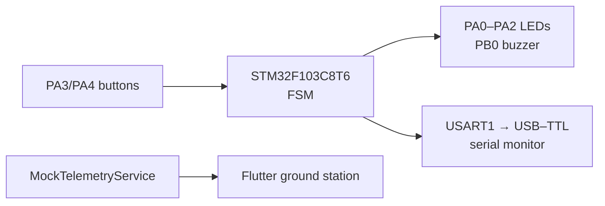

# CubeSat-Avionics-Verification-Platform
**STM32 航電驗證平台 × Flutter 地面站原型**  
*A ground-based CubeSat avionics / FlatSat engineering demonstrator.*

[📘 Tutorial](https://app.notion.com/p/CubeSat-Avionics-Verification-Platform-3d24ffce9c76803eb9aae5cd3beb5cc8) ·
[🎞️ Presentation](https://www.figma.com/proto/vbV4zKKOMBn7tcE5j3NPdd/DEJI-CubeSat?node-id=190-2738&t=gFOFCTlbmznq2yIt-0&scaling=scale-down-width&content-scaling=fixed&page-id=57%3A2&starting-point-node-id=190%3A2738) ·
[🛰️ Firmware](#firmware-phases--韌體階段) ·
[🖥️ Ground Station](#flutter-ground-station) ·
[🗺️ Roadmap](#roadmap--後續方向)

以 STM32F103C8T6 逐步驗證 LED、按鍵、有限狀態機（FSM）、USART1 事件日誌與警報輸出，並以 Flutter 製作地面站介面。這是桌上型教學與作品集專案；**目前沒有在軌衛星、實際 LoRa 鏈路或 STM32 到 Flutter 的遙測連線**。
&nbsp;
&nbsp;
## Learning Resources / 實驗教材
除了原始碼與硬體驗證流程之外，本專案亦整理了一套 **《立方衛星開發實務》實驗教程**，記錄各 Phase 的實作概念、操作流程與系統設計，適合搭配 Repository 內容閱讀。

📘 **實驗教程 / Hands-on Tutorial**  
[立方衛星開發實務 — CubeSat Avionics Verification Platform](https://app.notion.com/p/CubeSat-Avionics-Verification-Platform-3d24ffce9c76803eb9aae5cd3beb5cc8)

🎞️ **線上簡報 / Interactive Presentation**  
[DEJI CubeSat — Project Presentation](https://www.figma.com/proto/vbV4zKKOMBn7tcE5j3NPdd/DEJI-CubeSat?node-id=190-2738&t=gFOFCTlbmznq2yIt-0&scaling=scale-down-width&content-scaling=fixed&page-id=57%3A2&starting-point-node-id=190%3A2738)

> The tutorial explains the development process phase by phase, while the presentation provides a visual overview of CubeSat architecture, communication concepts, avionics verification, and the project roadmap.

&nbsp;&nbsp;
## 專案現況 / Project status

| 項目 | 目前內容 | 狀態 |
| --- | --- | --- |
| GPIO 與按鍵 | PA0–PA2 狀態燈、PA3/PA4 故障輸入 | 已有獨立 sketch |
| 狀態機 | BOOT、NOMINAL、WARNING、FAULT、RECOVERY | 已寫入 Phase 1.3/1.4 |
| 事件日誌 | USART1，9600 baud，狀態轉移紀錄 | 已寫入 Phase 1.3-B/1.4-A |
| 聲響警報 | PB0 有源蜂鳴器；WARNING/FAULT 不同節奏 | 已寫入程式，實體聲響待驗證 |
| 地面站 UI | 啟動畫面、衛星卡片、Dashboard、加入裝置頁 | Flutter 原型 |
| 遙測數值 | 電力、溫度、RSSI、封包數、姿態 | **Mock 數據，每 2 秒更新** |
| 裝置連接、QR、LoRa、感測器 | 介面占位或後續構想 | 尚未整合 |

「已寫入程式」不等於通過完整的硬體測試。Dashboard 的 `LIVE` 標籤目前僅為展示 UI。
#
## System overview / 架構



兩條路徑目前各自運行：STM32 經 UART 印出事件；Flutter 以本機模擬資料顯示 Dashboard。尚無串流解析器或無線下行。
#
## Hardware & pin map / 接線

下表對應 Phase 1.3-B 和 1.4-A 的 **STM32F103C8T6 / Blue Pill** sketch。

| 用途 | Pin | 接法 |
| --- | --- | --- |
| NOMINAL / green | PA0 | LED 串限流電阻 |
| WARNING / yellow | PA1 | LED 串限流電阻 |
| FAULT / red | PA2 | LED 串限流電阻 |
| WARNING / ACK | PA3 | 按鈕另一端接 GND；內建上拉，按下為 LOW |
| FAULT | PA4 | 按鈕另一端接 GND；內建上拉，按下為 LOW |
| Active buzzer | PB0 | Phase 1.4 輸出；核對元件電壓及驅動電流 |
| USART1 TX | PA9 | USB–TTL 的 RX |
| USART1 RX | PA10 | USB–TTL 的 TX（純看日誌可省略） |
| Common ground | GND | 開發板與 USB–TTL 共地 |

UART 設為 **9600 baud, 8N1**。USB–TTL 需使用相容的 **3.3 V 邏輯位準**；不要將未確認耐壓的 GPIO 直接接 5 V TX。ST-LINK 可用於 SWD 燒錄；供電請按開發板規格選擇，避免多個電源輸出直接相接。

**最小材料：** STM32F103C8T6、3 顆 LED 與各自的限流電阻、2 個按鈕、跳線、麵包板、USB–TTL。Phase 1.4 另需適用於該 GPIO 驅動方式的有源蜂鳴器。
#
## Firmware phases / 韌體階段

每個 `.ino` 是獨立 sketch，建議按順序驗證。

| Phase | 驗證目標 | 檔案 |
| --- | --- | --- |
| 0 | PA0 每 1.5 秒亮滅，確認燒錄與 GPIO | [LED blink](Phase%200%20STM32/Dev-Board-Verification_ShinyLED/Dev-Board-Verification_ShinyLED.ino) |
| 1.1 | 三色 LED 循環顯示 | [Status indicator](Phase1.1_Status%20LED/1.1_System-Status-Indicator_09052026/1.1_System-Status-Indicator_09052026.ino) |
| 1.2-A | 單鍵輸入 | [Single button](Phase1.2_Button%20Input/1.2-A_Single-Button-Input-Status-Indicator_09062026/1.2-A_Single-Button-Input-Status-Indicator_09062026.ino) |
| 1.2-B | 兩鍵輸入與優先順序 | [Dual button](Phase1.2_Button%20Input/1.2-B_Dual-Button-Input-Status-Indicator_09072026/1.2-B_Dual-Button-Input-Status-Indicator_09072026.ino) |
| 1.3-A | 五狀態 FSM 與按下邊緣偵測 | [FSM](Phase1.3_Finite%20State%20Machine%20%28FSM%29/1.3-A_Swith-Four-State-FSM_09072026/1.3-A_Swith-Four-State-FSM_09072026.ino) |
| 1.3-B | FSM 加入 UART 事件紀錄 | [FSM + USART1](Phase1.3_Finite%20State%20Machine%20%28FSM%29/1.3-B_FSM-USART1__Serial_Event_Log_09072026/1.3-B_FSM-USART1__Serial_Event_Log_09072026.ino) |
| 1.4-A | FSM、事件紀錄與蜂鳴器 | [Fault alarm](Phase1.4_Fault%20Alarm%20Output/1.4-A_FSM__USART1-Serial-Event-Log__Buzzer-Alarm/1.4-A_FSM__USART1-Serial-Event-Log__Buzzer-Alarm.ino) |

歷史檔名寫 `Swith-Four-State`，但該 sketch 實際定義**五個狀態**，以下以程式內容為準。
#
## FSM behavior / 狀態轉移

Phase 1.4-A 啟動後三燈亮約一秒，再轉為 NOMINAL。輸入以 HIGH → LOW 邊緣判斷，因此按住按鍵不會持續觸發。

| 當前狀態 | 觸發 | 下一狀態 | 輸出 |
| --- | --- | --- | --- |
| BOOT | 開機完成 | NOMINAL | 三燈 → 綠燈 |
| NOMINAL | PA3 按下 | WARNING | 黃燈；蜂鳴器每 500 ms 切換 |
| NOMINAL | PA4 按下 | FAULT | 紅燈；蜂鳴器每 150 ms 切換 |
| WARNING | PA4 按下 | FAULT | 紅燈 |
| FAULT | PA3 按下（ACK） | RECOVERY | 黃燈每 300 ms 切換；蜂鳴器關閉 |
| RECOVERY | 經過 3 秒 | NOMINAL | 綠燈 |

FAULT 在 NOMINAL 同時收到兩鍵事件時優先。現有程式**沒有 WARNING → NOMINAL 的直接轉移**。
#
## Quick start / 快速開始

### STM32 firmware

1. 安裝 Arduino IDE 與相容的 STM32 Arduino core，選擇實際使用的 F103C8T6 板型和燒錄方式。
2. 依腳位表完成共地、LED、按鍵及 USB–TTL 接線。蜂鳴器只在驗證 Phase 1.4 時加入。
3. 在 Arduino IDE 開啟單一階段的 `.ino` 並上傳；建議由 Phase 0 逐步前進。`Uart` 建構與 `setTx/setRx` API 若和安裝的 core 不符，應依版本調整。
4. 執行 1.3-B 或 1.4-A，開啟 9600 baud 序列監控器，操作 PA3/PA4 並觀察日誌。

按下 PA3、再按 PA4、再按 PA3，預期片段如下（此為**操作範例，非已儲存的測試結果**）：

```text
[EVENT] SYSTEM BOOT
[EVENT] BOOT -> NOMINAL
[EVENT] NOMINAL -> WARNING
[EVENT] WARNING -> FAULT
[EVENT] FAULT -> RECOVERY
[EVENT] RECOVERY -> NOMINAL
```

### Flutter ground station

在已安裝 Flutter SDK 且設定好執行目標的電腦上：

```bash
cd ground_station/flutter_application_1
flutter pub get
flutter run
```

程式從 Splash → My Satellites → Dashboard。清單展示固定的 `DEJI-SAT-01`，Dashboard 由 [`MockTelemetryService`](ground_station/flutter_application_1/lib/services/mock_telemetry_service.dart) 每 2 秒產生一筆資料。Add CubeSat 頁面輸入 Device ID 後僅模擬連接成功，並未儲存裝置；QR scanner 為占位功能。Telemetry、Events、Control 導覽項目也尚未接上功能頁。

## Verification checklist / 驗證清單

以下是重現流程，**不是已通過測試的聲明**：

- [ ] Phase 0：PA0 LED 每 1.5 秒切換。
- [ ] Phase 1.1：綠、黃、紅依序顯示。
- [ ] Phase 1.3-B：序列監控器顯示開機及狀態轉移紀錄。
- [ ] Phase 1.4-A：實測警報、ACK 靜音、3 秒恢復。
- [ ] Flutter：展示畫面可進入、模擬數據每 2 秒變化。
- [ ] MCU 到 App 的真實遙測封包（**尚未實作**）。
#
## Roadmap / 後續方向

1. **Sensors & power:** 溫濕度與電力感測、資料有效性檢查及故障注入。
2. **Telemetry protocol:** 版本、時間戳、序號、量測值與校驗；區分人類可讀事件日誌及可解析封包。
3. **Ground-station integration:** serial/bridge 資料來源、實際連線狀態、告警與事件紀錄，並保留 mock 展示模式。
4. **LoRa link:** 兩端模組、合法頻段配置、收發、RSSI、封包遺失與重傳測試。
5. **Verification evidence:** 接線圖、BOM、實驗結果及可重現展示影片。
#
## Known limitations / 已知限制

- Phase 1.4 有蜂鳴器控制程式，但 repository 沒有其實體聲響測試證據；需核對有源元件、驅動能力與接法。
- 按鍵採簡單邊緣偵測，沒有完整 debounce，機械彈跳可能造成額外事件。
- Phase 1.2-B 未按鍵的 `else` 分支目前也亮紅燈，作為獨立展示前應先修正；FSM 示範請用 1.3-B 或 1.4-A。
- Flutter 的狀態、RSSI、姿態、電壓和封包數是模擬資料；目前沒有實際 MCU、LoRa 或衛星連線。
- 本專案未提供飛行資格、環境測試或無線鏈路驗證結果。
#
## Author

**Deji Liu（劉永鈞）** · [@JeremyLiu9453](https://github.com/JeremyLiu9453)

*An iterative portfolio project in embedded systems, spacecraft avionics concepts, and ground-station prototyping.*

